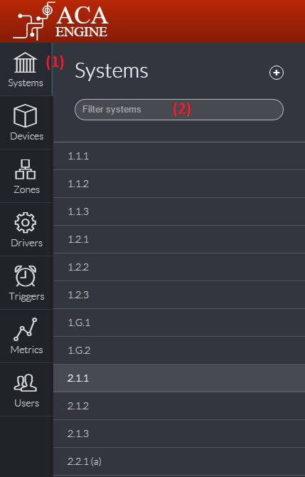
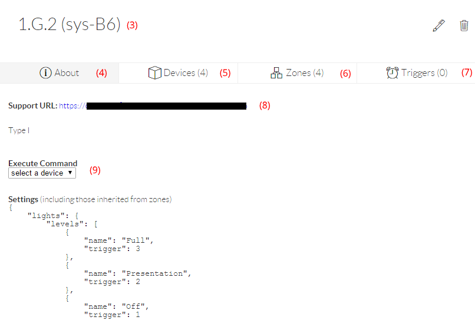
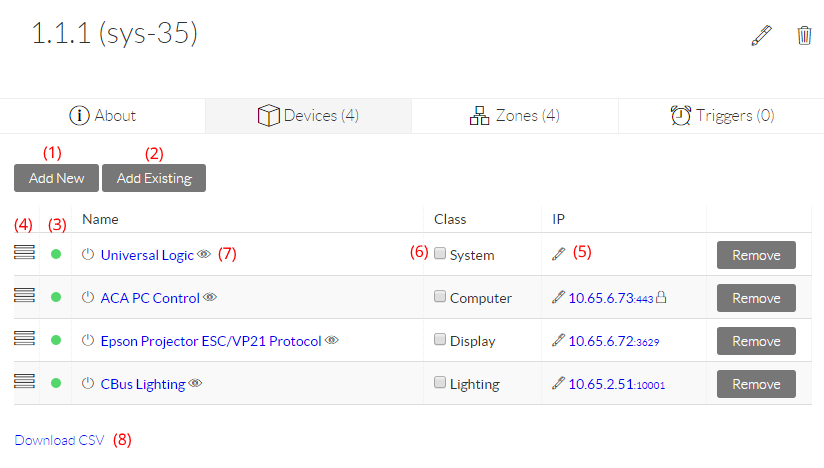
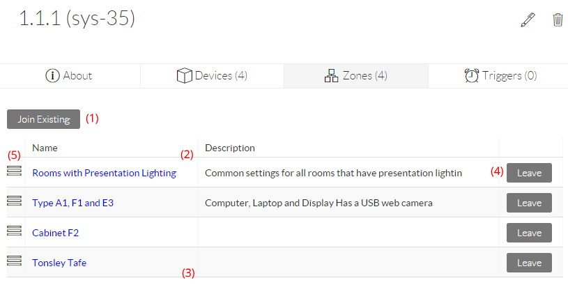
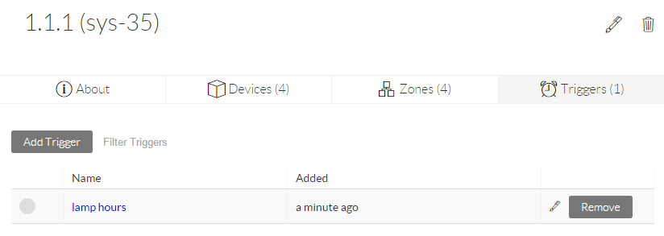
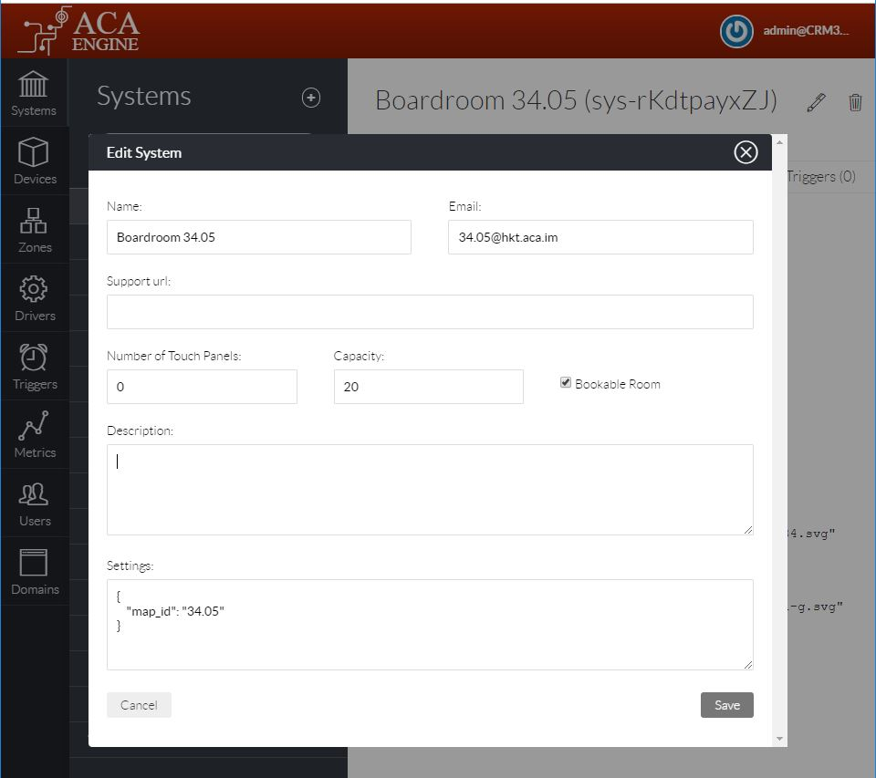

# Systems

The Systems section \(1\) displays a list of all systems currently defined. This list can be filtered by using the search box \(2\).

Once a System is selected from the list, it’s details will be displayed in the main section. The heading lists the system’s name and System ID \(3\) and below this are four tabs:

## About Tab

This section will list the system’s Support URL \(8\) \(which should usually be set to the URL of the main Interface for controlling the system\), description and settings. The system description \(metadata\) can be entered in [Markdown](https://github.com/adam-p/markdown-here/wiki/Markdown-Cheatsheet) format \(more information in the [Devices](https://docs.google.com/document/d/14ckH_Jzy_2Vx3uoRy1eN8-o1T96YT6Q7qnHfDKOiEAo/edit#heading=h.icobgqifc1vy) section\) and is inherited from Zones in the same way as settings. Manual commands to be executed on any of the devices \(9\).

## Devices Tab

The devices tab allows the creation of new devices \(1\) or the addition of existing devices to the current system \(2\). The device list shows each device’s current online status \(3\) and provides handles for drag and drop re-ordering \(4\). The settings and properties of each device can be viewed by clicking on its name, and edited by clicking on the edit icon \(5\).

At the bottom of the list, a link is provided to generate and download a CSV \(8\) \(Comma Separated Values\) file with a list of all devices in this system \(for offline reference purposes\).

The checkbox \(6\) on the the left of the Class type enables live debugging output for this device to the browser console \(F12 or Ctrl+Shift+I\). Pressing the eye symbol \(7\) next to the device name will instantly output the device’s current status information to the console to assist in troubleshooting scenarios.

## Zones Tab

This section lists the Zones that this system is a member of and allows Joining \(1\) and Leaving \(4\). See the Zones section under [Key Concepts](https://docs.google.com/document/d/14ckH_Jzy_2Vx3uoRy1eN8-o1T96YT6Q7qnHfDKOiEAo/edit#heading=h.dynovwa5zg81) for more information on the effects of Zones on Systems. Zones are listed in order of hierarchy \(highest \(2\) to lowest \(3\) \) and can be re-ordered by dragging the handles on the left \(5\). Click the Zone name to edit the settings and properties for that Zone or to see the other systems that are part of that Zone.

## Triggers Tab

This tab will list the Triggers that have been added to this system. Click on the Trigger name to view or edit the Triggers actions and properties.

## Room Booking

When Engine is integrated with a Directory service \(e.g. Exchange Online, via Graph API\), certain System settings will affect whether the Engine Staff API will treat the system as a Bookable Room and with what kind of behaviour. If your account has System Admin access, then the edit button \(a pen icon, at the top right of the system's page\) will be available. Clicking this icon will show the above popup where the following details can be edited:

* **Name**: The name of the system \(room\) that will be shown in ACAEngine apps like the room booking panel and staff app.
* **Email**: The mailbox that represents the room's calendar. This email address' default calendar will be queried to check which bookings exist for this room. The email address will be invited to any room bookings that a user creates from an ACAEngine app \(e.g. Staff App\). The mailbox should be confgured in the directory service \(typically Exchange online\) as a [Resource Mailbox](https://docs.microsoft.com/en-us/office365/admin/manage/room-and-equipment-mailboxes?view=o365-worldwide).
* **Support URL**: This optional link is useful for admins to click to immediately open a web app associated with the room \(e.g. booking panel or meeting room control panel\) in a new browser window.
* **Number of Touch Panels**: This number value should be set to the total number of fixed, physical touch panels that exist for this room. This includes room booking panels and meeting room \(AV\) control panels. The number is used to calculate the number of expected incoming web connections from fixed devices to apps relating to this system. When there are less panels connected than are expected, when a warning will show on the backoffice Metrics page.
* **Capacity**: This number indicates the number of seats that the room has. This will affect whether this room will be displayed in app search results that specify a minimum capacity.
* **Bookable Room**: This checkbox toggles whether the room should be listed in room available search results in ACAEngine apps like the Staff App and Concierge. Only systems with this box checked will show up in search results and thus be available for users to book via ACAEngine apps.
* **Description**: A text description for users, for keeping useful notes about the room. Does not affect any ACAEngine functions.
* **Settings**: Any settings defined here  will be used by Devices \(Modules\) that exist in this room. Settings defined here will override any Zone or Driver settings that are inherited.

### Settings

* `map_id`: If a unique ID is entered here and that ID exists as a tag on the SVG map, then map enabled ACAEngine apps will attempt to locate and pin that SVG element when requested by the user. The ACAEngine app may also change the CSS colour of that element to indicate the system's availability.

  * Example: `"map_id": "MyOrg-AU-SYD-BLD01-99.01"`   

* `allowed_groups`: An array optional of AD group names that are allowed to see and book this System in ACAEngine apps. If this setting is NOT present, then all users will be allowed to book the System.

  * Example: `"allowed_groups": "All_Admins_Group"` 

* `extra_features`: A space separated list of IDs for room features can be listed here. ACAEngine apps may use this setting to know that the system has that feature
  * Example: `"extra_features": "vc skype mics window dinner coffee"`

#### 

