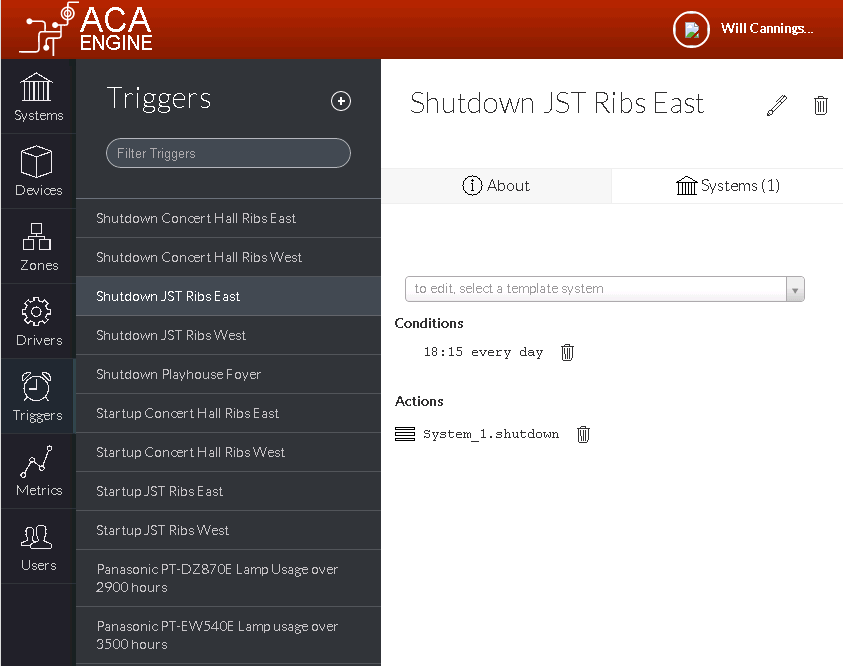
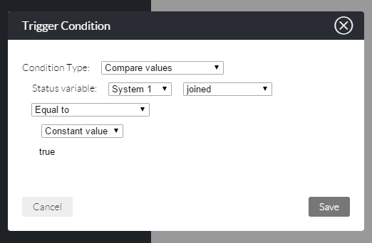
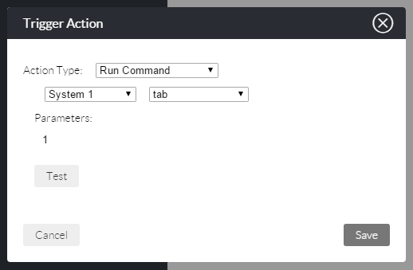

# Triggers

Triggers are a way to set process automation profiles in an Engine system. You can set a condition based on the available functions of any driver and set an action to any other driver or logic module. When the condition is met, the action is triggered. Triggers can be added or removed easily and becomes a way to make simple ongoing changes to your spaces without having to write logic code.

Triggers can be used for a mix of support actions based on device/system conditions \(EG “if the display reaches 60^C, trigger a shutdown and email support”\) and space logic \(“EG “if Sensor status is “1”, trigger air conditioning pre-set “3”\). You can stack up as many triggers in your system as you like.

## Creating a Trigger

From the Triggers section, click the + icon to add a new Trigger. Type in the Trigger name and a description.

### Defining Conditions

A template system must be selected before the list of available conditions and actions is populated. Choosing a template system does not apply this trigger to that system. Choose a template system that most closely matches the system\(s\) that this Trigger will be applied to.

Once a template system is selected, a Condition can be added by clicking the + icon next to the conditions heading. Conditions can be either Time or Value Comparison based. Status Values can be taken from the System or from any of it’s Devices and compared with constant values \(such as true/false or numeric/text values\) or to other Status Values.

### Defining Actions

Actions will be performed to the applied Systems every time the Conditions are met.

An email can be sent to a specified address or a Command can be executed on the System or any of its Devices.

Specifying no Action is a commonly used option, in this case a notification will be displayed on the Metrics Dashboard and no Command will be executed.

### Applying Systems

To Apply the new Trigger to a System, navigate to the Triggers tab of that System’s page, click ‘Add Trigger’ and select the Trigger.

