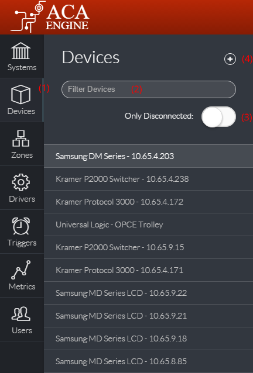
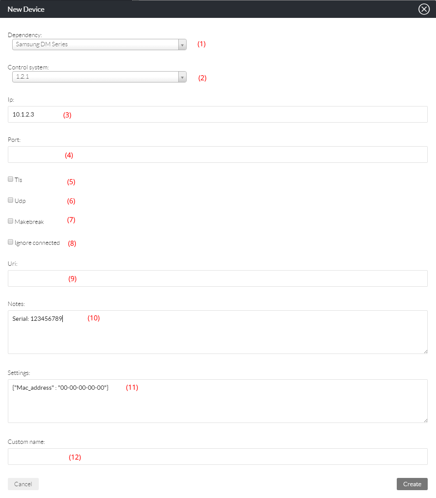
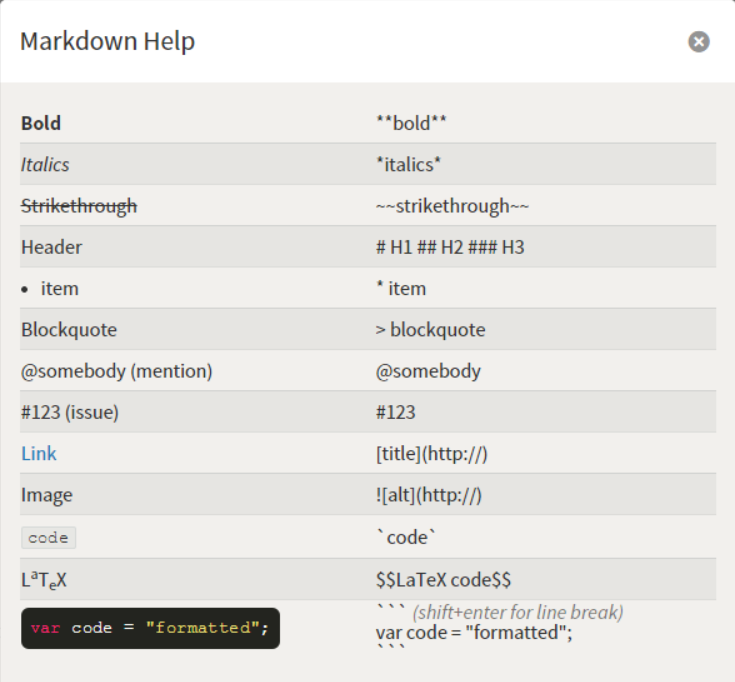

# Devices

The Devices section \(1\) will list all devices that have been added to ACA Engine. This list can be filtered \(2\) by Name, IP Address or online status \(3\).

Clicking on a Device in the list will bring up that device’s details in the main section for viewing and editing.

New devices can be added by clicking the Add icon \(4\).

## Adding and Editing Devices

To Edit an existing device click the pen icon, to add a new device, click the '+' icon \(4\). This will display a popup window where the new Device details can be entered. Select the desired Dependency \(1\) \(for more information on devices and dependencies, see [Key Concepts](https://docs.google.com/document/d/14ckH_Jzy_2Vx3uoRy1eN8-o1T96YT6Q7qnHfDKOiEAo/edit#heading=h.7eiwwwjsszu9)\) and System \(2\) to add the device to. Both drop down lists are text searchable.

If applicable, enter the IP address \(3\) and TCP/UDP Port \(4\) of the hardware device being added. In most scenarios, the port value can be left blank \(it will default to that dependency’s configured default\).

Note: For devices being controlled by RS-232, the IP address should be set to the IP address of the RS-232 gateway device \(e.g. Globalcache\) that will be connected to the device’s serial port. In these scenarios, the Port value should be changed to the correct value for the IP to RS-232 gateway device \(e.g. 4999 for Globalcache iTach units\).

The next section of checkboxes define the nature of the connection to the device. This will usually be dependent on the requirements of the device itself \(see the control protocol documentation for the device\).

* If the TCP connection to the device is to be encrypted, check the TLS checkbox \(5\) \(e.g. ACA PC Control Module\).
* If the connection is to be made via UDP instead of TCP, check the UDP checkbox \(6\).
* If the TCP session to the device should always be terminated instead of kept open, enable Make-Break \(7\)
* If the device is expected to be offline regularly \(e.g. a portable device\) and it’s status should not be tracked on the ACA Metrics Dashboard, check Ignore connected \(8\)

The URI field \(9\) is only for devices that are controlled by HTTP requests \(instead of direct TCP commands\). See Driver Types under [Key Concepts](https://docs.google.com/document/d/14ckH_Jzy_2Vx3uoRy1eN8-o1T96YT6Q7qnHfDKOiEAo/edit#heading=h.5vlc4vgj6sfu) for more information. If the Driver is type ‘Device’ then this field should be blank and the IP \(3\) should be entered. If the Driver is type ‘Service’ then the IP field should be blank and the control URI of the device should be entered \(this should be documented in the device’s control protocol manual\).

The Notes section \(10\) is for any text based metadata \(for reference purposes\). Notes are inherited from Dependencies in the same way as Settings. [Markdown](https://github.com/adam-p/markdown-here/wiki/Markdown-Cheatsheet) format is supported:

Additional settings can be defined in the Settings section \(11\). See [Key Concepts](https://docs.google.com/document/d/14ckH_Jzy_2Vx3uoRy1eN8-o1T96YT6Q7qnHfDKOiEAo/edit#heading=h.dbxexbsp1oib) for more information on the function of Settings. Devices will always inherit settings defined in the Driver that they are an instance of. Settings must be in valid JSON format or else the field will be highlighted red and the ‘Create’ button will be disabled.

The Custom Name field \(12\) is for defining a name that can be used to refer to this device in the System’s settings. For example, if there are multiple video switchers in the system, one can be referred to as ‘Table Front’ and another as ‘Table Rear’ and these names can be used to differentiate between them in the System’s settings.

## Deleting Devices

Devices can be deleted by clicking the Bin icon. Deleting a device will immediately remove it from any Systems that it has been added to. To remove a device from a System without deleting it, visit that System’s device tab instead and click ‘Remove’

