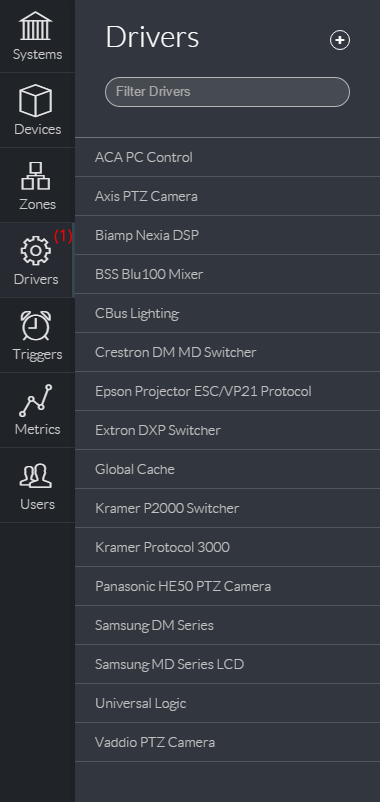
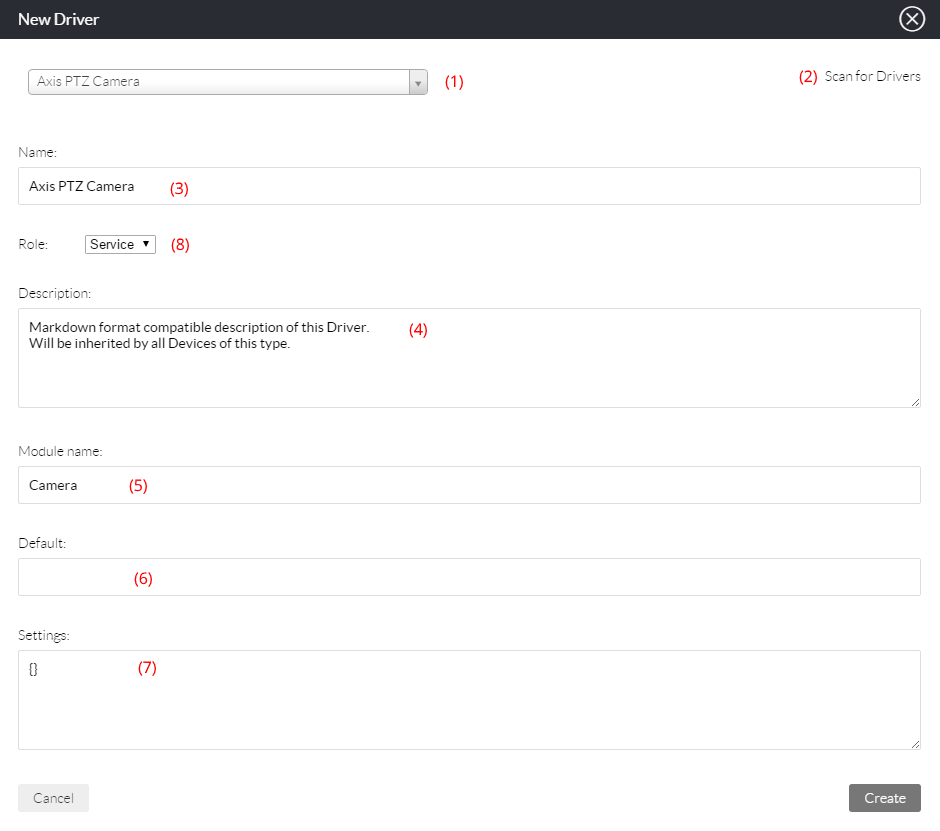

# Drivers

The Drivers section \(1\) will list all the drivers which have been added to ACAEngine.

Settings and a list of Devices can be viewed for each Driver by clicking on the driver name.

New Drivers can be added by clicking the + icon.

## Adding and Editing Drivers

Upon clicking + icon, the New Driver popup will appear. ACA Engine will automatically detect the drivers available on the server and present a searchable drop down list \(1\). If the repository has been updated then a Scan for new drivers should be initiated \(2\).

Select a Driver to add from the list \(1\) and additional fields will appear:

* Name \(2\): Devices that are an instance of this driver will appear in the device list in the format “Name - IP Address”
* Role \(8\): Define whether the Driver should be added as a Device, Logic or Service. This should be left as default. See Key Concepts for more information
* Description \(4\): Markdown format description of the driver. It will be inherited by all devices that are an instance of this Driver
* Module Name \(5\): The module name defines what kind of hardware type the System Logic should treat the device as. This should be left as default. More information can be found by inspecting the Ruby code of the System Logic used
* Default Port \(6\): Defines the default IP port on which ACA Engine should attempt to connect to all devices defined of this type. This should generally be left as default. Individual devices can still override the default defined here by defining a port for that device
* Settings \(7\): JSON format settings that will be inherited by all devices of this type. For more information on the function of Settings and their inheritance. See Key Concepts

