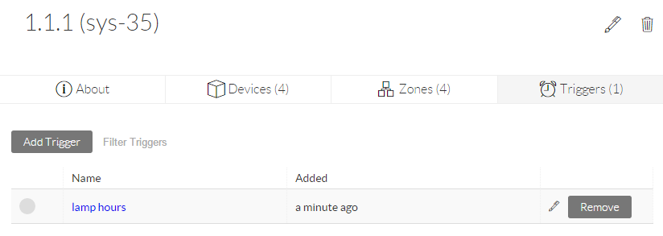

# Managing Systems

The Systems section \(1\) displays a list of all systems currently defined. This list can be filtered by using the search box \(2\).

  
Once a System is selected from the list, it’s details will be displayed in the main section. The heading lists the system’s name and System ID \(3\) and below this are four tabs:

## About Tab

This section will list the system’s Support URL \(8\) \(which should usually be set to the URL of the main Interface for controlling the system\), description and settings. The system description \(metadata\) can be entered in [Markdown](https://github.com/adam-p/markdown-here/wiki/Markdown-Cheatsheet) format \(more information in the [Devices](https://docs.google.com/document/d/14ckH_Jzy_2Vx3uoRy1eN8-o1T96YT6Q7qnHfDKOiEAo/edit#heading=h.icobgqifc1vy) section\) and is inherited from Zones in the same way as settings. Manual commands to be executed on any of the devices \(9\).

## Devices Tab

The devices tab allows the creation of new devices \(1\) or the addition of existing devices to the current system \(2\). The device list shows each device’s current online status \(3\) and provides handles for drag and drop re-ordering \(4\). The settings and properties of each device can be viewed by clicking on its name, and edited by clicking on the edit icon \(5\).

At the bottom of the list, a link is provided to generate and download a CSV \(8\) \(Comma Separated Values\) file with a list of all devices in this system \(for offline reference purposes\).

The checkbox \(6\) on the the left of the Class type enables live debugging output for this device to the browser console \(F12 or Ctrl+Shift+I\). Pressing the eye symbol \(7\) next to the device name will instantly output the device’s current status information to the console to assist in troubleshooting scenarios.

## Zones Tab

This section lists the Zones that this system is a member of and allows Joining \(1\) and Leaving \(4\). See the Zones section under [Key Concepts](https://docs.google.com/document/d/14ckH_Jzy_2Vx3uoRy1eN8-o1T96YT6Q7qnHfDKOiEAo/edit#heading=h.dynovwa5zg81) for more information on the effects of Zones on Systems. Zones are listed in order of hierarchy \(highest \(2\) to lowest \(3\) \) and can be re-ordered by dragging the handles on the left \(5\). Click the Zone name to edit the settings and properties for that Zone or to see the other systems that are part of that Zone.

## Triggers Tab

This tab will list the Triggers that have been added to this system. Click on the Trigger name to view or edit the Triggers actions and properties.

