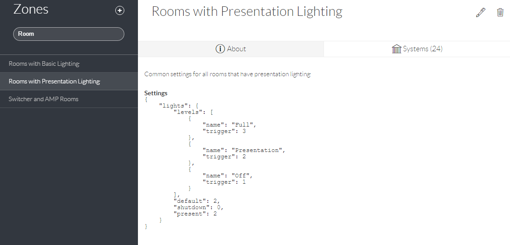

# Zones

The Zones Section presents a searchable list of all defined Zones. Selecting a Zone will list that Zone’s Description, Settings \(inherited by all Systems in that Zone\) and Systems. New Zones can be added by clicking the + icon.

