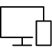
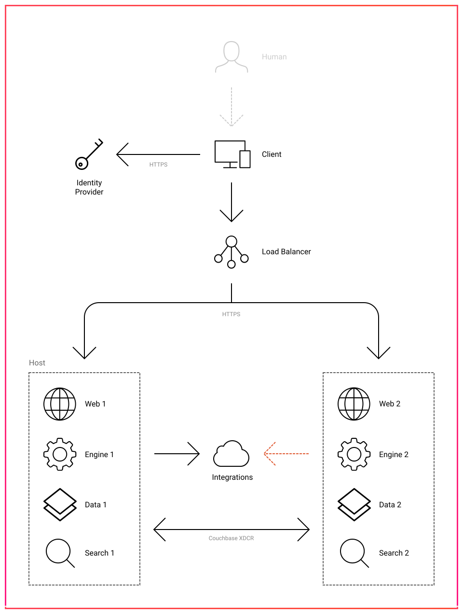
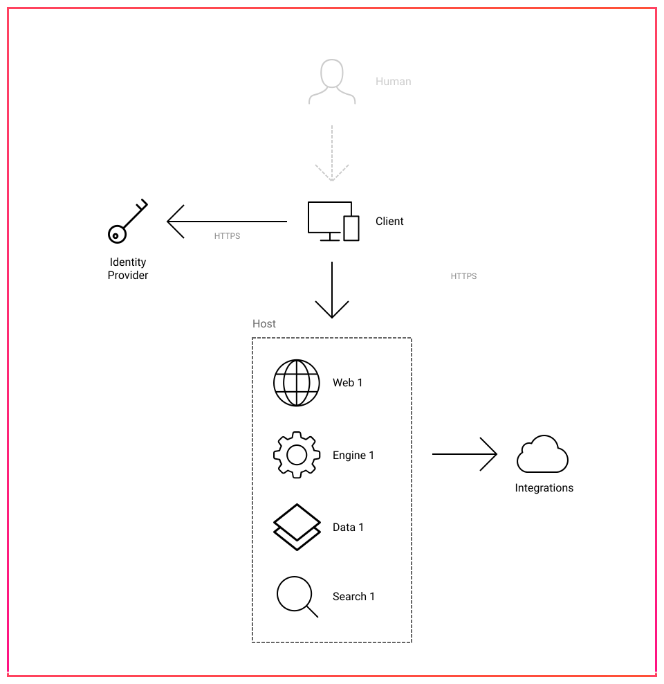

# System Architecture

Engine is packaged and distributed as a set of Docker containers for deployment within private cloud, or on-premise infrastructure. All application components run on hosts owned and managed by your organistation.

## Application Services

Each of these components provide a core service to the application and require at least one instance. These may be replicated any number of times to provide redundancy, additional load capacity, or geographic distribution to improve latency in multi-site deployments.

###  Engine

This is the core application. Instances of this service provide the API endpoints and run drivers. All communication with external service integrations, devices and third-party platforms takes place from these nodes.

###  Web

Instances of the web service are responsible for the routing of incoming traffic from API users and serving static assets used by user interfaces. These are a Dockerized instance of the [Nginx](https://www.nginx.com/) web server. Web nodes provide the gateway between external users and instances of the Engine service.

###  Data

Persistent storage–system/zone configuration, settings, device metadata, user data and access logs–is managed as a distributed document store, backed by [Couchbase](https://www.couchbase.com/). Instances of this service are only interacted with by Engine nodes.

###  Search

A dedicated search service is used to provide fast, efficient access to information managed by Data nodes. This is supported via [ElasticSearch](https://www.elastic.co/products/elasticsearch). As with the Data service, all interaction with Search nodes takes place directly from the Engine service.

## External Components

In addition to the core application services, a number of external components contribute to the overall deployment environment. These are not created as part of Engine, but may require configuration as part of the deployment.

###  Clients

Clients are devices running interfaces distributed by Web nodes, or native apps and other services which use the Engine API. Common examples may be a phone running a staff app, room booking panels or wayfinding displays.

###  Identity Provider

Interactions with Engine must be associated with a valid user. To simplify UX and improve security, authentication integrates tightly with existing identity providers operating in an environment. This may be services such as Azure AD, Google Sign-In or other services providing SAML or OAuth2 endpoints.

###  Load Balancer

In distributed and active-passive deployments a load balancer is used upstream of Web nodes to direct traffic to the appropriate infrastructure.

###  Integrations

The specifics of external service integrations will vary based on your system requirements and functionality, however this commonly includes calendaring services, network infrastructure, audio/video devices, lighting gateways and other systems that form part of your physical environment.

## Common Deployment Scenarios




Distributed deployments split application services across hosts using a three-tier architecture–web, app and db. This provides isolation of different application components and provisioning of resources appropriate for each.

Each of these stacks may be replicated as required to meet availability requirements. To provide redundancy in the event of network or infrastructure failure it is recommended that these replications take place across availability zones.


Due to limitations of hardware being interacted with, integrations will only be active from a single Engine node at any point in time. In the case of primary node failure, the secondary node will establish device connectivity and begin accepting control traffic.





In an active-passive deployment each stack runs on a self-contained host. The load balancer should direct all traffic to the primary host. If this becomes unavailable, traffic should be re-route to the secondary host to provide continued operation.




Standalone deployments are not recommended for production use. They provide a good option for UAT environments, proof-of-concept systems, or test environments where availability is not a critical concern.


In a standalone deployment all application components are provisioned on a single host. This provides simplicity of deployment and minimises infrastructure requirements, but offers no redundancy in the event of network or infrastructure failure.



