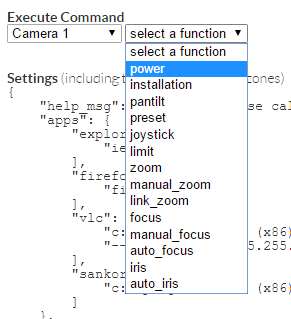

# Live Monitoring

ACAEngine features live, in-browser debugging of operational systems via backoffice. All debug messages are outputted to the browser console \(F12 or Ctrl+Shift+I, then Console tab\).

Ensure that the Console logging is set to enable Verbose messages, as highlighted below:

## Viewing Debug Messages

Debugging is done from the Systems section. Select the system to debug and then click the Device tab.

The checkbox \(6\) on the the left of the Class type enables live debugging output for this Device to the browser console. Pressing the Eye symbol \(7\) next to the device name will instantly output the device’s current status information to the console to assist in troubleshooting scenarios.

## Sending Manual Commands

The About tab of the System page contains a drop down list \(9\) that allows the selection of a device to send a manual control command to.

The device’s response to these commands will be output to the bottom of right of the window and \(if enabled - above\) to the browser console.

Some commands will require parameters. When blank, the text field will describe the type of parameter required by the function.

In the event that ACA Engine is not able to send a command to the device, an error message \(red instead of blue\) will appear at the bottom of the screen with the details.

