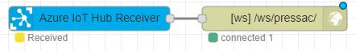

# Azure IOT Hub

[Many IOT devices](https://catalog.azureiotsolutions.com/) can be configured to push messages to Microsoft Azure IOT Hub. IOT Hub can receive and collate messages from thousands of devices, and provide a single interface for applications such as ACAEngine to securely connect to in order to receive realtime updates from any connected devices.

## Connection via Node-RED

ACAEngine supports connection to Azure IOT Hub via a local Node-RED docker container \(at `node-red:1880`\) which ships by default as part of all ACAEngine deployments. Once the connection is configured, ACAEngine modules will recieve realtime notifications from MS Azure IOT Hub via the Node-RED websocket.

`[ACAEngine module] >websockets> [Node-RED]:1880 >AMQP over websockets> [MS Azure IOT Hub]`

### Configuring Node-RED to connect to Azure IOT Hub

Prerequisite: First, ensure you've read the article on how ACAEngine works with [Node-RED](node-red.md)

1. Install the Node-RED [connector for Azure IOT Hub](https://flows.nodered.org/node/node-red-contrib-azure-iot-hub), by running the below command on the VM/machine where ACAEngine is installed:

   ```text
   docker exec -it node-red npm install node-red-contrib-azure-iot-hub
   docker restart node-red
   ```

2. Access the Node-RED web interface by visiting http://localhost:1880 to configure Node-RED.
3. Create an "Azure IoT Hub Receiver" node. Connect it it to your IOT Hub by setting the `connectionstring`, which you will find in your Azure Portal, under your _IOT Hub > Shared Access policies > iothubowner > Connection string-primary key_ See heading ["Reading all messages received into Azure IoT Hub"](https://flows.nodered.org/node/node-red-contrib-azure-iot-hub) for more details.
4. Create a "websocket output" node and connect the output of the Azure node to the input of the websocket node



For instructions on how to connect and ACAEngine Module to Node-RED, see the page on [Node-RED](node-red.md)

