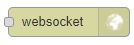

# Node-RED

[Node-RED](https://nodered.org/) is now included by default as part of all ACAEngine deployments.

## Access to Node-RED web interface

By default, the Node-RED web interface is exposed _locally only_ on the machine that is running engine, at [http://127.0.0.1:1880](http://127.0.0.1:1880). If accessing the Node-RED web interface from a remote client, use methods such as SSH port forwarding to securely mirror the engine server's 127.0.0.1:1880 to your machine's 127.0.0.1:1880.

## Installing nodes

Additional Node-RED nodes can be installed by running the below command on the machine running Engine:

`docker exec -it node-red npm install <package-name>`

For example, to install the [connector for Azure IOT Hub](https://flows.nodered.org/node/node-red-contrib-azure-iot-hub), run:

`docker exec -it node-red npm install node-red-contrib-azure-iot-hub`

## Connecting Engine to Node-RED

### Node-RED Websocket output

ACAEngine connects to Node-RED via Node-RED's websockets modules \(one for input and one for output\). Drag an output websocket module into the Flow, double-click it and set the Type to `Listen on` and the Path to `/ws/`. 

### ACAEngine websocket input

* On the Drivers page of ACAEngine backoffice, import the [Node-RED Websocket](https://github.com/acaprojects/ruby-engine-drivers/blob/beta/modules/node_red/websocket.rb) driver by searching for it and clicking "Import".
* Now in any System, add a module of that driver and set:
  * IP: `node-red`
  * Port: `1880`

    After creating the module, start it and then monitor the [debug messages](https://github.com/acaengine/docs/tree/da66522f4d00324648877ea8a6ba9f92333bb7a3/backoffice/debugging.md).

Messages coming out of the Node-RED websocket output should appear as console log output when debugging the ACAEngine "Node-RED Websocket" module. The status variable "message\_received" will also update to show the last string recieved. Simple strings may be used as inputs for ACAEngine Triggers.

The "Node-RED Websocket" driver can be used as a template for creating new drivers that take actions upon receiving messages from Node-RED, or send websocket messages to a Node-RED Websocket Input module. One example of this is the [Pressac desk sensor driver](https://github.com/acaprojects/ruby-engine-drivers/blob/beta/modules/pressac/sensors/ws_protocol.rb), which uses Node-RED in subscribe to real time updates from Azure IOT Hub.

