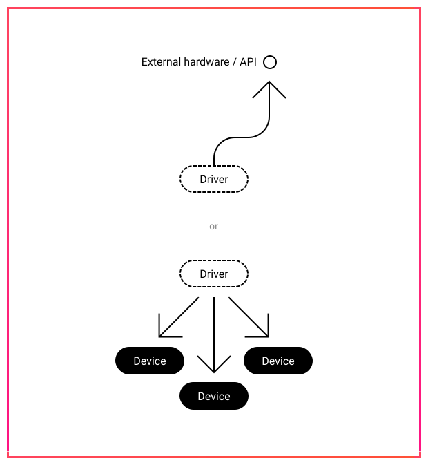

# Drivers

_Drivers_ are modular plugins used by ACAEngine. They provide the ability to either:

* communicate with external systems \(hardware, or other software platforms\), or
* coordinate actions across devices and build complex behaviours.

All drivers, regardless of type, must be instantiated as [devices](devices.md) before they can be used.

