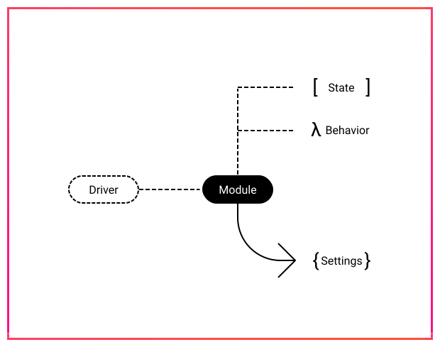

# Modules

_Modules_ are instances of [drivers](drivers.md). These represent a device to be controlled, service integration or piece of logic that controls how a system should behave.


Modules were referred to as 'Devices' in older versions of ACAEngine.


All modules expose two things:

1. **State** - status information about the device, service, or higher level logic they control \(e.g. power status, upcoming booking info, recent chat messages\)
2. **Behavior** - actions which they can execute \(e.g. power on/off, create/edit booking, post a chat message\)

Each module can be individual started or stopped at any time. When started, ACAEngine will attempt to connect to the associated physical device or service and keep track of its status. When Stopped, ACAEngine will disconnect from that device and not send any commands to it. Or in the case of logic modules, this can be used to enable / disable its functionality.

Modules must be associated with at least one [system](systems.md). Where a device or service is used across multiple systems \(such as a lighting gateway, centrally racked matrix switcher, or common service such as a chatbot integration\) the same instance can be shared across everywhere it is needed.

