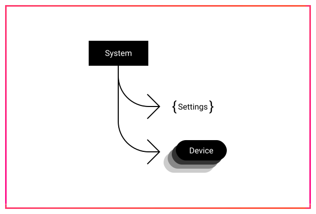

# Systems

A s_ystem_ is a collection of [devices](devices.md) along with [settings](settings.md) and basic metadata \(name, descriptions etc\). It provides that main logical building block within ACAEngine deployments.

Systems often represent physical spaces \(such as a meeting room\) but can also represent such things as a digital signage endpoint or a non-physical system with information based inputs and outputs. 

